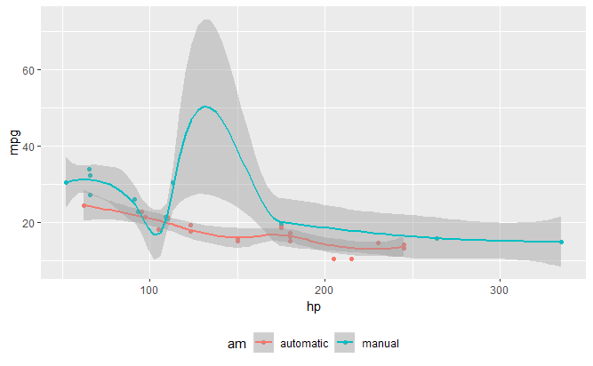
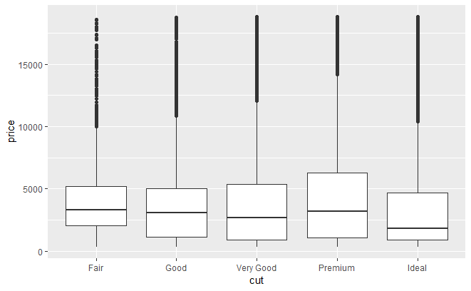

```{r setup, include=FALSE, error=TRUE, message=FALSE, warning=FALSE} 
knitr::opts_chunk$set(echo = FALSE, 
                      comment = NA, 
                      error = TRUE, 
                      warning = FALSE, 
                      message = FALSE, 
                      fig.align = 'center',
                      results = "asis"
                      )

options(knitr.table.format = "html") 
```

```{r load_libraries, message=FALSE}
library(knitr)
library(kableExtra)
library(ggplot2)
```


A plot has been screenshot and saved as a `.png` file. Refer to Fig. \@ref(mymtcars2).


## Manual figure

{#mymtcars2}


{#DiamondsBoxplot}


A boxplot for cut vs. price in the diamonds dataset as shown in Fig. \@ref(DiamondsBoxplot).
