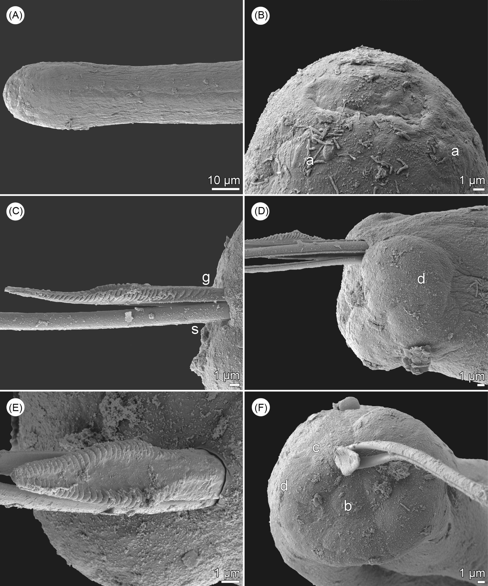

```{r echo=FALSE,warning=FALSE}

 library(knitr)
 library(kableExtra)
  opts_chunk$set(fig.path='figure/graphics-', 
                 cache.path='cache/graphics-', 
                 fig.align='center',
                 external=TRUE,
                 echo=TRUE,
                 warning=FALSE,
                 fig.pos='H'
                )
  a4width<- 8.3
  a4height<- 11.7
```

Some text here look the citation works [@moravec1980obstacle]

```{r moravec, echo=FALSE, fig.cap="look the citation doesn't work [@moravec1980obstacle]"}

```

